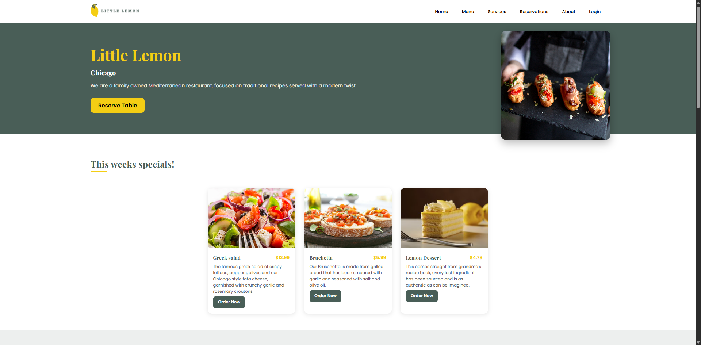
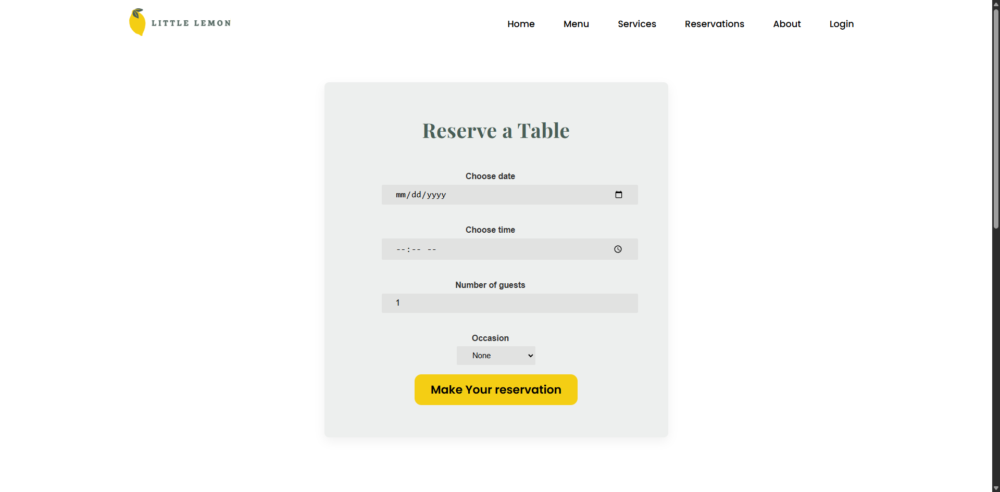

# 🍋 The Little Lemon — Restaurant Web App


A responsive React single-page application (SPA) that showcases **Little Lemon**, a fictional Mediterranean restaurant.  
It includes interactive pages for browsing the menu, exploring services, booking tables, and viewing order confirmations — built to demonstrate modern UI/UX and React best practices.

---

## 🧭 Table of Contents
- [Overview](#overview)
- [Features](#features)
- [Tech Stack](#tech-stack)
- [Project Structure](#project-structure)
- [Setup & Installation](#setup--installation)
- [Testing](#testing)
- [Screenshots](#screenshots)
- [Future Enhancements](#future-enhancements)
- [Author](#author)

---

## 📝 Overview

The **Little Lemon** web app is a front-end project developed using **React** and **React Router**.  
It highlights component-driven architecture, modular styling, and client-side navigation for a seamless user experience.

---

## ✨ Features

### 🧭 Navigation
- Responsive **navbar** with a **hamburger sidebar** for mobile devices.
- **React Router v6** for smooth, client-side routing across multiple pages.

### 🍽️ Menu System
- Displays weekly specials sourced from a static `recipes.js` data file.
- Each menu item includes an image, description, and price.
- “**Order Now**” button triggers **SweetAlert2** confirmation modals.

### 📅 Booking System
- A booking form for date, time, number of guests, and occasion.
- On submission, navigates to a **confirmation page**.
- Structured and ready for backend integration.

### 🧑‍🍳 Services
- Showcases various offerings — Dine-In, Takeout, Delivery, Catering, Events, and Cooking Classes.
- Includes **customer testimonials** with ratings and flowing layout.

### 💬 Footer & Contact
- Contains navigation links and **social media handles** (Facebook, Instagram, Twitter).

### 🧪 Testing
- Unit testing setup with **Jest** and **React Testing Library**.
- `App.test.js` included as a starter example.

---

## ⚙️ Tech Stack

| Category | Tools |
|-----------|-------|
| **Frontend** | React 19, React Router v6 |
| **UI / UX** | CSS3 (custom responsive design), Lucide React Icons |
| **Alerts / Modals** | SweetAlert2 |
| **Testing** | Jest, React Testing Library |
| **Tooling** | Create React App (CRA), npm scripts |

---

## 🗂️ Project Structure

```bash
The_Little_Lemon/
├─ public/
│   ├─ index.html
│   ├─ manifest.json
│   └─ favicon.ico
└─ src/
    ├─ index.js
    ├─ App.js / App.css / App.test.js
    ├─ recipes.js
    ├─ reportWebVitals.js
    ├─ setupTests.js
    ├─ components/
    │   ├─ Navbar.js
    │   ├─ Header.js
    │   ├─ Main.js
    │   ├─ Footer.js
    │   ├─ About.js
    │   ├─ Services.js
    │   ├─ Menu.js
    │   ├─ Booking/
    │   │   ├─ Booking.js
    │   │   └─ BookingForm.js
    │   ├─ ConfirmedBooking.js
    │   └─ Login.js
    └─ images/
```
## 🧩 Setup & Installation
Clone the repository
```bash
git clone https://github.com/Powel29/The_Little_Lemon.git
cd The_Little_Lemon
```
Install dependencies
```bash
npm install
```
Start the development server
```bash
npm start
```
View in browser
```bash
http://localhost:3000
```
## 🖼️ Screenshots
- Home Page
  


- Reservation Page




## 🚀 Future Enhancements
- 🔗 Integrate a backend API for booking and menu management
- 🧾 Add form validation and error handling
- 👤 Implement login authentication
- 🦻 Improve accessibility (ARIA labels, keyboard navigation)
- 🖼️ Add image optimization and lazy loading
- 📱 Add animations and transitions for smoother UX


## 👨‍💻 Author
Powel Lawrence Lewis

Student Project for Coursera Front-End Development Course

